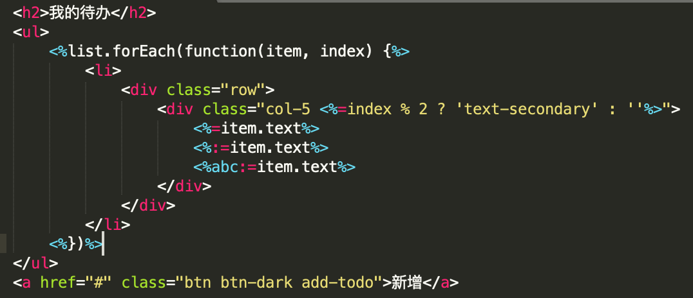

# [template-sublime](https://github.com/yanhaijing/template-sublime)

[template.js](https://github.com/yanhaijing/template.js) plugin for sublime, [click here](https://packagecontrol.io/packages/templatejs) to install.

## How to install

Way 1: with [Package Control](http://wbond.net/sublime_packages/package_control)

1. Run "Package Control: Install Package" command, find and install `templatejs` plugin.

Way 2: with [Package Control](http://wbond.net/sublime_packages/package_control) + Custom Repository:

1. Run "Package Control: Add repository" and add https://github.com/yanhaijing/template-sublime
2. Run "Package Control: Install Package" command, find and install `templatejs` plugin.

Way 3: download and copy

1. Clone or [download] git repo into your packages folder (in ST2, find Browse Packages... menu item to open this folder)


## Features

- Syntax highlight

Support syntax highlight for template.js

Source code example

```
<h2>我的待办</h2>
<ul>
    <%list.forEach(function(item, index) {%>
        <li>
            <div class="row">
                <div class="col-5 <%=index % 2 ? 'text-secondary' : ''%>">
                    <%=item.text%>
                    <%:=item.text%>
                    <%abc:=item.text%>
                </div>
            </div>
        </li>
    <%})%>
</ul>
<a href="#" class="btn btn-dark add-todo">新增</a>
```

Highlighting effect



## CHANGELOG
[CHANGELOG.md](https://github.com/yanhaijing/template-sublime/blob/master/CHANGELOG.md)

## TODO
[TODO.md](https://github.com/yanhaijing/template-sublime/blob/master/TODO.md)

## Contributor guide
开发时，将当前项目软连接到sublime的插件目录(菜单/Preference/Browse Packages)即可实时预览，可能需要重启

```
ln -s . xxx/Packages/User
```

发布时需要打tag，然后push到github即可

```
git tag x.y.z
```

## Reference
- [How To Make a Custom Syntax Highlighting for Sublime Text](http://ilkinulas.github.io/programming/2016/02/05/sublime-text-syntax-highlighting.html)
- [官网API](http://www.sublimetext.com/docs/3/syntax.html)
- [如何打包发布](https://packagecontrol.io/docs/submitting_a_package)